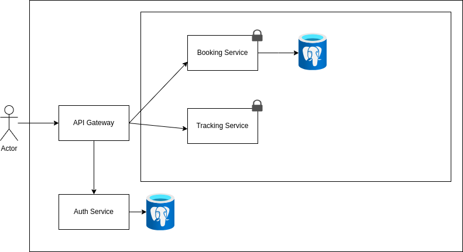
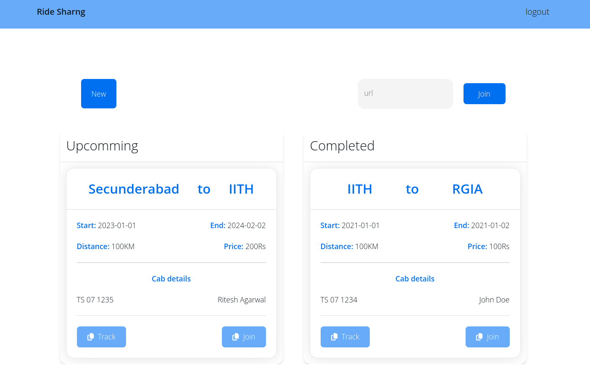

# Ride Sharing
A ride sharing platform with user and admin functionalities. Built with Spring Boot, Spring Security, PostgreSQL, React and Next UI.

## Features
- User registration and login
- Booking a ride
- Viewing upcoming and past rides
- Sharing a ride join invite link
- Joining a ride with invite link
<!-- - Feedback on rides -->
<!-- - Admin dashboard -->
<!-- - Ride tracking functionality-->

## Architecture


### Booking Service

The booking service is responsible for handling all booking related operations. Which includes creating a booking, viewing upcoming and past bookings, and joining a ride with an invite link.

### Auth Service

The auth service is responsible for handling all user related operations. Which includes user registration, login, and logout. It based on Spring Security and uses basic authentication.
<!-- JWT for authentication. -->

<!-- ### Tracking service

The tracking service is responsible for handling all tracking related operations. Which includes tracking a ride and collecting ride data.

### Admin Service

The admin service is responsible for handling admin operations. Which includes viewing all users, bookings, and rides. -->

## User Interface


## Running Application

### Frontend
```bash
cd user-interface
npm run start
```

### Backend
1. Start the discovery server
```bash
cd microservice/discover-server && mvn spring-boot:run
```

2. Run the API gateway
```bash
cd microservice/api-gateway && mvn spring-boot:run
```

3. Start the auth service
```bash
cd microservice/auth-server && mvn spring-boot:run
```

4. Start the booking service
```bash
cd microservice/booking-server && mvn spring-boot:run
```

